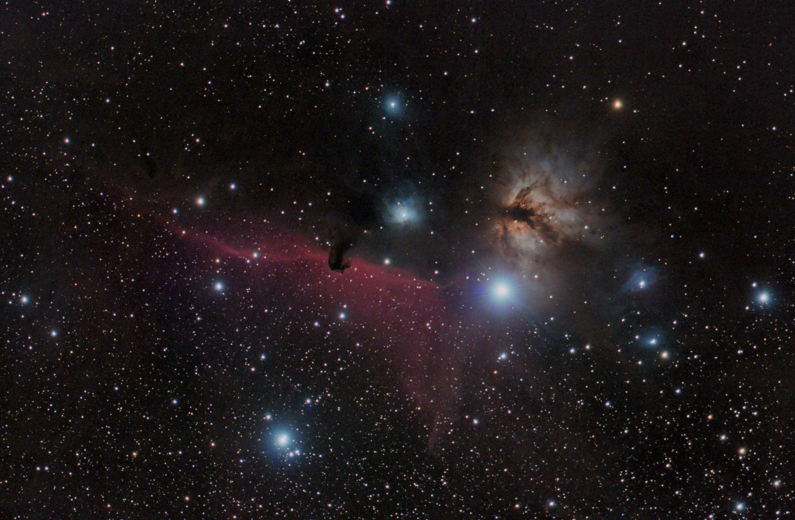

# Horsehead / Flame 2013-2016 Final V1

Accepted result for this pass: `04c` with the plain v1 polish.

## Deliverables

| Product | Path |
| --- | --- |
| PixInsight working image | `work/03-nonlinear/03h-04c-v1-polish.xisf` |
| TIFF export | `work/03-nonlinear/horsehead-04c-v1-polish.tif` |
| JPEG documentation preview | `docs/images/horsehead-04c-v1-polish.jpg` |

Optional comparison retained, but not selected as the default presentation:

| Product | Path |
| --- | --- |
| Mild star-reduced comparison | `work/03-nonlinear/03i-04c-v1-polish-star-reduced.xisf` |
| Mild star-reduced preview | `docs/images/horsehead-04c-v1-polish-star-reduced.jpg` |

## Selected Data Mix

V1 uses a narrow-field master blend, not one raw integration:

| Source | Role | Inclusion |
| --- | --- | --- |
| 2013-12-31 Canon EOS 60D unmodified, `good-with-geosats` | Broadband color and geometry base | Included |
| 2016-01-09 Canon EOS Rebel T1i modified, `good/modded` | Clean red/H-alpha support | Included |
| 2016-01-09 Canon EOS Rebel T1i modified, `washed-out-maybe` | Additional red/H-alpha support | Included at half weight |

The 60D branch is the broadband color anchor. The modified T1i branches are used as red/H-alpha support only, because they improve the IC 434 and Horsehead signal but should not define the whole image color.

## Excluded From V1

| Source | Reason |
| --- | --- |
| 2016-01-09 Canon EOS 60D unmodified, `good/unmodded` | Only 7 frames with mixed exposures; likely too small to improve this v1 enough to justify another branch. |
| 2013-02-08/09 70mm wide-field Orion/Flame/Horsehead data | Different field scale and composition; better kept as a separate context image or low-frequency experiment. |
| Mild star-reduction branch | Useful comparison, but subtle enough that the plain v1 polish remains the cleaner default. |

## Why 04c Was Chosen

Fixed red-channel ROI measurements showed that the washed-out T1i data did add signal, but also increased the halo/background cost around Alnitak. The half-weight blend kept most of the useful IC 434 lift while reducing that penalty.

| Branch | IC 434 contrast/std | Alnitak halo mean |
| --- | ---: | ---: |
| 60D only | 0.104 | 0.179 |
| 04a, clean T1i support | 0.116 | 0.208 |
| 04b, clean plus full washed T1i support | 0.128 | 0.227 |
| 04c, clean plus half washed T1i support | 0.124 | 0.220 |

Visually, `04c` gives a better red-emission and Horsehead silhouette result than the 60D-only branch, without taking on the full halo/background cost of the full washed-out blend.

## Caveats

- The T1i branches were no-dark controls because matching T1i darks were not found.
- The 2013 60D broadband branch used matching darks but no flats, so large-scale background correction remains part of the processing burden.
- Alnitak remains the hard constraint for this field. More aggressive stretching or red support quickly makes the halo look worse.
- A future `v1b` could test a slightly brighter background, a tighter Horsehead crop, or a separate wide-field context image, but those are optional follow-ups rather than blockers for this v1.
