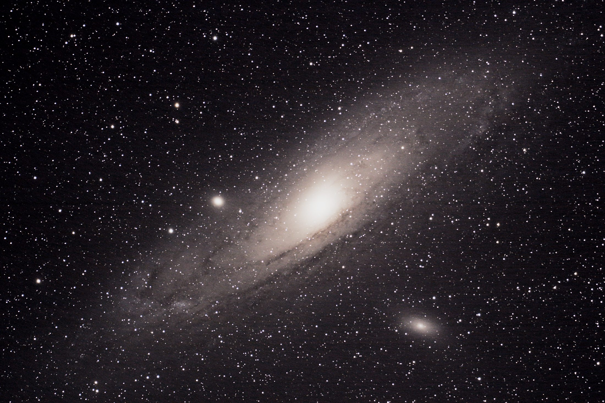
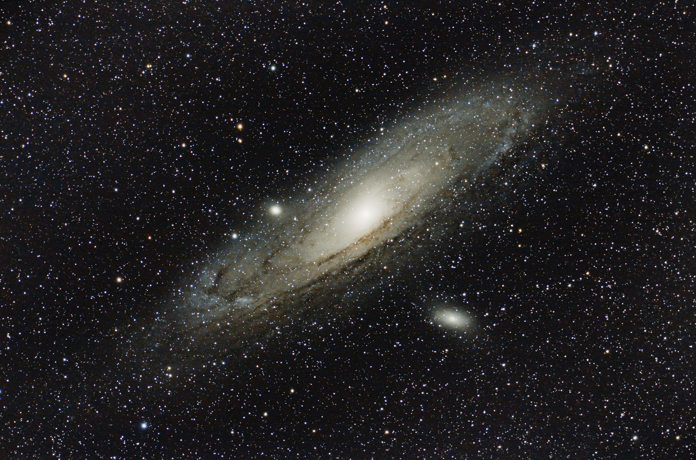

# M31 Andromeda Processing — Status

**As of:** 2026-05-24, v3 ED80-aware final export complete
**Pipeline progress:** 95% — Phase 1 done, Phase 2 done, Phase 3 nonlinear stretch/enhancement/crop/export done, plus v2 color/chroma refinement and v3 ED80-aware star/detail polish. Optional external-tool experiments remain.

---

## Where we are

```
PHASE 1 — Calibration + Integration              ✅ DONE
PHASE 2 — Linear Post-Integration
  ├─ 2a ABE (gradient/vignette removal)          ✅ DONE
  ├─ 2b Plate-solve                              ✅ DONE (fixed bad focal-length assumption)
  ├─ 2c SPCC Color Calibration                   ✅ DONE
  ├─ 2d SCNR (residual green removal)            ✅ DONE
  └─ 2e MultiscaleLinearTransform NR             ✅ DONE
PHASE 3 — Non-linear                              ✅ V3 DONE
  Stretch → Mask building → HDRMT → LHE → Curves
  → Crop → Export → v2 color/chroma cleanup → v2 Export
  → v3 mild star reduction/detail polish → v3 Export
  Optional: bright-star halo treatment / external tools
```

## Final-looking images are ready to inspect

`work/03-nonlinear/m31-final.jpg` — first finished JPEG export.
`work/03-nonlinear/m31-final.tif` — 16-bit archival TIFF export.
`work/03-nonlinear/03c-final.xisf` — PixInsight working final.

`work/03-nonlinear/m31-final-v2.jpg` — conservative v2 JPEG export.
`work/03-nonlinear/m31-final-v2.tif` — conservative v2 16-bit archival TIFF export.
`work/03-nonlinear/03e-final-v2.xisf` — conservative v2 PixInsight working final.

`work/03-nonlinear/m31-final-v3.jpg` — current recommended ED80-aware JPEG export.
`work/03-nonlinear/m31-final-v3.tif` — current recommended ED80-aware 16-bit archival TIFF export.
`work/03-nonlinear/03g-final-v3.xisf` — current recommended ED80-aware PixInsight working final.

Compressed images checked into the repo for quick comparison:

- [2013 Photoshop result](images/original-2013-photoshop.jpg)
- [2026 PixInsight v3 result](images/pixinsight-v3-ed80.jpg)

## Quick visual comparison

| Original 2013 Photoshop result | 2026 PixInsight automation v3 |
|---|---|
|  |  |

What you should see:
- Sky background: neutral gray/brown (no green tint — fixed by SPCC/SCNR)
- M31 bulge: pale warm yellow
- M31 disk: faint, with blue-gray spiral arms, stronger dust lanes in v3, and reduced green/cyan bias
- Stars: round near center, comatic at corners, mildly reduced in v3
- Image is now **nonlinear** and ready to view/export.

---

## Dataset summary

| Field | Value |
|---|---|
| Target | M31 (Andromeda Galaxy) |
| Camera | Canon EOS 60D DSLR, unmodified (APS-C CMOS, 14-bit CR2, RGGB Bayer) |
| Imaging telescope | Explore Scientific ED80 air-spaced doublet refractor |
| Solved focal length | 386.29 mm effective focal length (earlier 50 mm assumption was wrong) |
| Mount | Sky-Watcher NEQ6 Pro |
| Guide scope / camera | Orion Short Tube 80 + Orion StarShoot AutoGuider (SSAG) |
| Capture/control software | PHD2, BackyardEOS, EQMOD |
| Original 2013 processing software | DeepSkyStacker and Adobe Photoshop CS6 |
| Site | Keemale Estate, Coorg, Karnataka, India |
| Date | 2013-12-30 (raw lights), 2013-12-31 (matched darks) |
| Good long lights found on disk | 27× 240s @ ISO 1600 plus 1× 240s @ ISO 800 |
| Lights used in current PixInsight rerun | 27× 240s @ ISO 1600 |
| Darks | 9× 240s @ ISO 1600 (+25 to +30°C) |
| Flats | None — handled with ABE |
| Bias | None — not needed with matched-exposure darks |
| Current rerun integration | 108 minutes |
| Image size | 5184×3456 (raw) → 5202×3464 (registered) → 5167×3444 (autocrop) |
| Pixel scale | 2.301 arcsec/pixel |
| Field of view | 3°18'11.2" × 2°12'6.0" |

---

## What's on disk

```text
<repo>/
├── readme.md
├── docs/
│   └── project-layout.md
├── projects/
│   └── m31-andromeda-2013/
│       ├── docs/
│       │   ├── pipeline.md                 Original tuned pipeline plan
│       │   ├── status.md                   This file
│       │   ├── original-2013-processing.md  Evidence from old DSS/Photoshop files
│       │   ├── images/
│       │   │   ├── original-2013-photoshop.jpg
│       │   │   └── pixinsight-v3-ed80.jpg
│       │   └── research/
│       │       ├── 01-general-pipeline.md         PixInsight M31 stock pipeline (470 lines)
│       │       ├── 02-m31-specific.md             M31 HDR / dust lanes / Mirach (440 lines)
│       │       ├── 03-dslr-no-flats.md            Canon 60D darks-only + no-flats workflow (430 lines)
│       │       └── 04-platesolve-wide-field.md    Why ImageSolver fails on 25° FoV (290 lines)
├── scripts/
│   ├── run-wbpp-phase1.ps1            PowerShell driver for Phase 1 (WBPP)
│   ├── run-phase2.ps1                 PowerShell driver for Phase 2 stages
│   ├── test-wbpp-loadonly.ps1         Sanity check (now unused)
│   └── pjsr/
│       ├── 02a-abe.js                 Phase 2a: ABE script
│       ├── 02b-platesolve.js          Phase 2b: plate-solve (4 failed attempts)
│       ├── 02c-spcc.js                Phase 2c: SPCC script
│       ├── 02c-manualcolor.js         Phase 2c: manual BN+CC fallback
│       ├── 02d-scnr.js                Phase 2d: residual green removal
│       ├── 02e-mlt-nr.js              Phase 2e: conservative linear NR
│       ├── 03f-ed80-v3.js             Phase 3f: ED80-aware star/detail polish
│       ├── test-hello.js              Debug helper
│       ├── test-include.js            #engine v8 discovery
│       └── test-progress.js           File-logging diagnostic
└── projects/m31-andromeda-2013/work/
    ├── wbpp-out/                      Phase 1 outputs from WBPP
    │   ├── master/
    │   │   ├── masterDark_*.xisf                    207 MB  (built from 9 raw darks)
    │   │   ├── masterLight_*.xisf                   619 MB  (27-frame integration)
    │   │   ├── masterLight_*_autocrop.xisf          221 MB  (used for Phase 2 input)
    │   │   └── LN_Reference_*.xisf                  207 MB  (local-norm reference)
    │   ├── calibrated/                              27 calibrated CFA frames
    │   ├── debayered/                               27 debayered RGB frames
    │   ├── registered/                              27 aligned RGB frames
    │   └── logs/                                    WBPP log + ProcessContainer
    ├── 02-linear/
    │   ├── 02a-abe.xisf                             204 MB  (Phase 2a output)
    │   ├── 02b-solved.xisf                          213 MB  (Phase 2b WCS solved)
    │   ├── 02c-color.xisf                           204 MB  (older manual BN+CC fallback)
    │   ├── 02c-spcc.xisf                            213 MB  (Phase 2c)
    │   ├── 02d-scnr.xisf                            213 MB  (Phase 2d)
    │   └── 02e-linear-nr.xisf                       213 MB  (Phase 2e — current best)
    ├── 03-nonlinear/
    │   ├── 03a-stretched.xisf                       213 MB  (MaskedStretch)
    │   ├── 03b-enhanced.xisf                        213 MB  (HDRMT/LHE/Curves)
    │   ├── 03c-final.xisf                           180 MB  (cropped final)
    │   ├── 03d-refined-v2.xisf                      213 MB  (subtle green cleanup + masked chroma smoothing)
    │   ├── 03e-final-v2.xisf                        180 MB  (cropped v2 final)
    │   ├── 03f-ed80-v3.xisf                         213 MB  (mild star reduction + restrained detail/color polish)
    │   ├── 03g-final-v3.xisf                        180 MB  (cropped v3 final)
    │   ├── m31-final.tif                            180 MB  (archive export)
    │   ├── m31-final.jpg                            2.3 MB   (share export)
    │   ├── m31-final-v2.tif                         180 MB  (conservative archive export)
    │   ├── m31-final-v2.jpg                         2.3 MB   (conservative share export)
    │   ├── m31-final-v3.tif                         180 MB  (recommended archive export)
    │   ├── m31-final-v3.jpg                         2.2 MB   (recommended share export)
    │   └── masks/                                   generated range/star masks
    └── logs/                                        Per-stage PJSR logs
```

---

## Decisions log

### Equipment & dataset
- **Dropped the 800 ISO frame** in `good/240s-800iso/`. Different ISO, no matching dark.
- Original 2013 notes described **28× 240s** lights. The files currently on disk show **27 good ISO 1600 lights plus 1 good ISO 800 light**; the current PixInsight automation rerun used the 27 ISO 1600 files for 108 minutes integrated.
- The preserved 2013 DSS reports show two historical stack attempts: a 24-frame quality-pruned stack using Auto Adaptive Weighted Average, then a 27-frame ISO 1600 stack using Kappa-Sigma rejection. See `docs/original-2013-processing.md`.
- **Built fresh master dark** from the 9 raw CR2 darks rather than reusing the 2014 DSS master. PixInsight's Winsorized Sigma Clipping is statistically better than DSS's Kappa-Sigma.
- **No bias frames acquired** — confirmed not needed with matched-exposure darks. Optimize Darks OFF.

### Plate-solve (recovered after bad scale assumption)
- **Why we tried:** SPCC color calibration needs WCS metadata.
- **Why earlier attempts failed:** ImageSolver was seeded as Canon 60D + 50 mm, giving ~17.78"/px and a ~25° field. Your original 2013 notes confirm the actual imaging telescope was an Explore Scientific ED80 refractor, which matches the solved ~386 mm effective focal length.
- **Actual solution:** Re-ran ImageSolver on `02a-abe.xisf` with a telephoto/telescope seed. It solved successfully and refined to 2.301"/px, 386.29 mm effective focal length, 3°18' × 2°12' FoV, stereographic projection, TYCHO-2 catalog, 417 control points.
- **Tried:**
  1. Default settings (non-exhaustive) — 30s, failed
  2. `tryExhaustiveInitialAlignment=true`, magnitude=14 — 10 min, failed
  3. pre-ABE master + `restrictToHQStars=true` + `brightThreshold=1.5` — 12 min, failed
  4. Stereographic projection (per research) + spline order 3 + sensitivity 0.3 — failed because the seed scale was still wrong
  5. Corrected seed (`focal=230`, converged to 386.29 mm) — solved in ~34s
- **Current output:** `work/02-linear/02b-solved.xisf`
- **Next use:** Solved image feeds SPCC. Manual `BackgroundNeutralization` + `ColorCalibration` remains available as a fallback.

### Phase 2c SPCC color calibration
- Installed and configured Gaia DR3/SP small-set XPSD database files locally. Keep the machine-specific catalog directory in `.env` as `PI_GAIA_DR3SP_DIR` if future scripts need it.
- Verified PixInsight's Gaia process reports `isValid=true`, `databaseHasMeanSpectrumData=true`, and all 4 DR3/SP database file paths.
- Ran `SpectrophotometricColorCalibration` on `work/02-linear/02b-solved.xisf` with Average Spiral Galaxy white reference and Sony Color Sensor UV/IR-cut OSC filters.
- Result: `work/02-linear/02c-spcc.xisf` produced successfully. The older `02c-color.xisf` remains as a manual BN+CC fallback.

### Phase 2d/2e final linear cleanup
- Ran SCNR on `02c-spcc.xisf`: green removal, amount 0.50, Average Neutral protection, luminance/lightness preservation on.
- Ran MultiscaleLinearTransform linear NR on `02d-scnr.xisf`: layers 1-4 only, conservative thresholds/amounts, built-in inverted linear mask to protect high-SNR galaxy/star signal.
- Result: `work/02-linear/02e-linear-nr.xisf` is the end-of-Phase-2 linear master. Preview: `work/02-linear/02e-linear-nr-stf.jpg`.

### Phase 3 first-pass final
- Ran MaskedStretch on `02e-linear-nr.xisf` to create `03a-stretched.xisf`.
- Generated a galaxy range mask and applied masked HDRMultiscaleTransform, two restrained LocalHistogramEqualization passes, and gentle Curves/Saturation to create `03b-enhanced.xisf`.
- Performed a conservative edge crop and exported:
  - `work/03-nonlinear/03c-final.xisf`
  - `work/03-nonlinear/m31-final.tif`
  - `work/03-nonlinear/m31-final.jpg`
- Patched `03c-final-export.js` with `DynamicCrop.noGUIMessages = true` so reruns do not prompt about deleting WCS metadata.

### Phase 3 v2 refinement
- Added `03d-refine-v2.js`, using a subtle nonlinear SCNR pass (`amount=0.18`) to reduce residual green/cyan bias without pushing the image magenta.
- Reused the `03b-galaxy-range-mask.xisf` mask inverted, then applied MultiscaleLinearTransform to chrominance only. This smooths background color noise while protecting the galaxy/dust-lane structure.
- Exported the conservative v2 final set:
  - `work/03-nonlinear/03e-final-v2.xisf`
  - `work/03-nonlinear/m31-final-v2.tif`
  - `work/03-nonlinear/m31-final-v2.jpg`
- Visual inspection: v2 is subtly less green/cyan than the first final; dust lanes and the galaxy core remain intact.

### Phase 3 v3 ED80-aware refinement
- Added `03f-ed80-v3.js`, starting from `03d-refined-v2.xisf`.
- Loaded the generated `03b-star-mask.xisf` and applied mild MorphologicalTransformation star reduction with a 5×5 structure, Selection operator, `selectionPoint=0.24`, `amount=0.22`, one iteration.
- Applied restrained CurvesTransformation contrast/saturation polish to make better use of the solved ED80-scale data without heavy deconvolution.
- Exported the current recommended final set:
  - `work/03-nonlinear/03g-final-v3.xisf`
  - `work/03-nonlinear/m31-final-v3.tif`
  - `work/03-nonlinear/m31-final-v3.jpg`
- Visual inspection: v3 keeps M31 intact, makes the dust lanes more legible, and mildly reduces the star field. It is the current best stock-PixInsight result.

---

## Memory files saved (`~/.claude/projects/.../memory/`)

These are durable lessons that should apply to any future astro / PixInsight work:

1. **wbpp-no-platesolve-in-phase1.md** — Disable plate-solve in WBPP Phase 1 to avoid interactive dialog breaking headless mode.
2. **preserve-pipeline-outputs.md** — Long-running pipelines preserve output dirs by default; `-Fresh` flag for explicit wipes.
3. **resumable-pipelines.md** — Every multi-stage pipeline must be resumable from any checkpoint.
4. **pjsr-idioms.md** — Single global file handle for logging; integer enums (not `.prototype.Name`); `#engine v8` required for library mode includes; `--automation-mode` + `--force-exit` for headless.
5. **run-pi-in-background.md** — All PI runs use `run_in_background: true` so the conversation stays interactive.

---

## How to resume / re-run

**Phase 1 (re-run from scratch, ~17 min):**
```powershell
& .\scripts\run-wbpp-phase1.ps1 -Fresh
```

**Phase 2a (re-run just ABE):**
```powershell
& .\scripts\run-phase2.ps1 -OnlyStage a
```

**Phase 2c (re-run SPCC):**
```powershell
& .\scripts\run-phase2.ps1 -OnlyStage c
```

**Phase 2d/e (re-run final linear cleanup):**
```powershell
& .\scripts\run-phase2.ps1 -FromStage d
```

**Phase 3 final export rerun:**
```powershell
& .\scripts\run-phase3.ps1 -FromStage c
```

**Phase 3 v2 refinement/export rerun:**
```powershell
& .\scripts\run-phase3.ps1 -FromStage d
```

**Phase 3 v3 ED80-aware refinement/export rerun:**
```powershell
& .\scripts\run-phase3.ps1 -FromStage f
```

**Continue from current point:** Optional refinements: bright-star halo treatment, DBE/GraXpert comparison, or BlurXTerminator/StarXTerminator experiments.

---

## Outstanding questions for you

1. **Inspect `m31-final-v3.jpg`** — this is the recommended current final.
2. Optional next refinements: DBE/GraXpert comparison, external-tool trial, or halo cleanup on bright stars.

---

## Time spent so far

| Activity | Approx. duration |
|---|---|
| Initial exploration, research delegation, pipeline doc | ~30 min |
| Phase 1 — WBPP run (after parameter debugging) | 17 min |
| Phase 2a — ABE | 6 sec |
| Phase 2b — Plate-solve attempts × 4 | ~24 min cumulative (all failed) |
| Phase 2c — Manual color cal | 7 sec |
| Gaia DR3/SP setup + SPCC | ~10 min |
| Phase 2d/e — SCNR + MLT linear NR | ~3 min |
| Phase 3 first-pass stretch/enhance/export | ~15 min |
| Phase 3 v2 color/chroma refinement/export | ~1 min |
| Phase 3 v3 ED80-aware refinement/export | ~75 sec |
| Debugging / log infrastructure / research delegation | ~20 min |
| **Total wall-clock from project start** | **~2.5 hours** |
