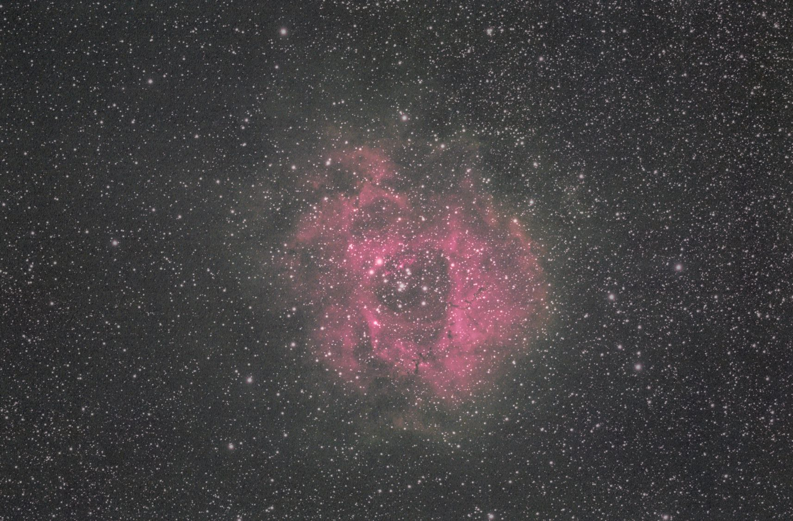

# Rosette Nebula 2014 V3B Presentation Candidate

Current preferred presentation result: `rosette-starxterminator-v3b`.

This is a presentation candidate, not a final scientific color-calibration result. The underlying SPCC/background behavior is still documented as unresolved for this no-flats DSLR emission-nebula dataset.

## Deliverables

| Product | Path |
| --- | --- |
| PixInsight working image | `work/03-nonlinear/03s-rosette-starxterminator-v3b.xisf` |
| TIFF export | `work/03-nonlinear/rosette-starxterminator-v3b.tif` |
| JPEG export | `work/03-nonlinear/rosette-starxterminator-v3b.jpg` |
| Documentation preview | `docs/images/rosette-starxterminator-v3b.jpg` |

Reusable StarXTerminator layers:

| Product | Path |
| --- | --- |
| Starless layer | `work/03-nonlinear/03s-v2e-starxterminator-starless.xisf` |
| Stars-only layer | `work/03-nonlinear/03s-v2e-starxterminator-stars.xisf` |
| Starless preview | `work/03-nonlinear/rosette-starxterminator-v2e-starless.jpg` |
| Stars-only preview | `work/03-nonlinear/rosette-starxterminator-v2e-stars.jpg` |

## Subs Used

The StarXTerminator v3b result uses the same integration as the main Rosette PixInsight branch.

| Group | Camera | Subs | Exposure | ISO | Total |
| --- | --- | ---: | ---: | ---: | ---: |
| `good/east`, top-level | Canon EOS 60D unmodified | 3 | 240s | 1600 | 12 min |
| `good/west`, top-level | Canon EOS 60D unmodified | 30 | 240s | 1600 | 120 min |
| **Total used** | Canon EOS 60D unmodified | **33** | **240s** | **1600** | **132 min / 2h12m** |

Calibration:

| Type | Count | Exposure | ISO | Notes |
| --- | ---: | ---: | ---: | --- |
| Darks | 9 | 240s | 1600 | Same 60D dark library used historically |
| Flats | 0 | - | - | None available |
| Bias | 0 | - | - | None used |

Not used in v3b:

| Source | Count | Reason |
| --- | ---: | --- |
| Historical DSS-equivalent subset | 31 | Exact old selection not reconstructed yet |
| Extra satellite-trail folders | 4 | Deferred until rejection/frame-quality review |
| Bad/trailing/framing trials | Various | Rejected |

## Process Summary

1. Built the repeatable baseline from 33 top-level good 240s ISO 1600 lights.
2. Ran WBPP with 9 matching 240s ISO 1600 darks, no flats, no bias.
3. Solved the integrated master at about 386 mm effective focal length, ignoring misleading `50 mm` CR2 metadata.
4. Investigated the gray-green Rosette color problem through CFA tests, SPCC tests, manual DBE, linked previews, DSS-style per-channel background calibration, and SPCC diagnostics.
5. Built the best SPCC-based visual branch through manual DBE plus metadata-restored SPCC, then selective nebula color enhancement and sky cleanup.
6. Polished that branch through v2e/v2g; v2g became the best pre-StarXTerminator presentation candidate.
7. Ran StarXTerminator on `03r-dbe-manual-spcc-visual-v2e-polished.xisf`, before the older MorphologicalTransformation star-reduction step, to get cleaner starless/stars separation.
8. Enhanced the starless layer modestly, reduced and partially desaturated the stars-only layer, recombined, cropped, and exported v3/v3b.
9. Selected v3b because it reduced bright-star dominance while keeping sampled dark-sky color close to neutral.

Quick JPEG comparison:

| Branch | Bright pixels >= 220 | Average sampled dark-sky R-G | Average sampled dark-sky B-G |
| --- | ---: | ---: | ---: |
| v2g | 1.166% | +0.71 | +0.94 |
| v3 | 0.906% | -0.18 | +0.64 |
| v3b | 0.240% | -0.49 | +0.61 |

## Human Involvement

Rosette required more human feedback than the M31 and Horsehead runs.

| Human input | Why it mattered |
| --- | --- |
| Manual DBE sample placement in PixInsight | Automatic background modeling was too easily confused by the nebula-rich, no-flats field. Human-placed samples avoided the central Rosette and produced a smoother large-scale background model. |
| Visual feedback that the raw/embedded CR2 preview showed red Rosette signal | This redirected the investigation from "there is no red signal" toward preview rendering, Canon white balance, linked versus unlinked STF, and DSS-style per-channel background calibration. |
| Installing StarXTerminator | This unblocked the clean starless/stars workflow that the local inpaint/matte scripts could not achieve. |
| Interactive SPCC test | An interactive SPCC run showed the manual-DBE image could be processed by SPCC, which helped distinguish process-execution failure from missing metadata in scripted/headless runs. The notes do not explicitly identify who operated this step. |

## Caveats

- V3B is a visual presentation result, not proof that SPCC color calibration is solved.
- No flats were available, so background and vignetting remain the central technical weakness.
- The stock Canon 60D has weak H-alpha response compared with modified cameras, so Rosette color has a lower ceiling than the Horsehead modified-camera support workflow.
- A future calibration-focused branch should search for flats or improve gradient/flat modeling before judging SPCC again.
