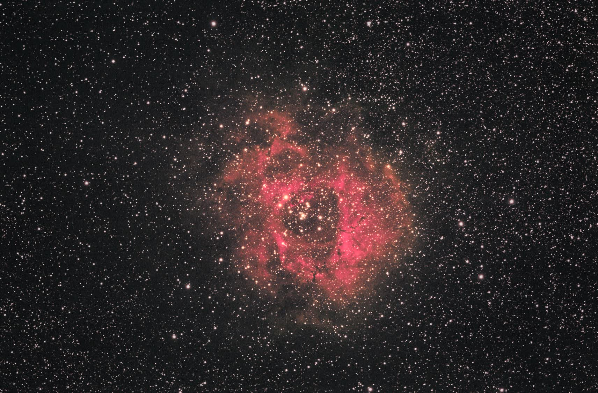

# Rosette Nebula 2014 V3G Old-Red Depth Candidate

This branch was created after comparing the 2026 StarXTerminator v3b result against the historical 2014 finished-work image. The goal was not stricter color calibration; it was to recover more of the older image's visual depth and darker crimson/red feel while keeping the cleaner StarXTerminator separation.

Follow-up note: v3g successfully adds depth, but the recombined star field is warmer/redder than desired. For the same red/depth treatment without the reddish stars, see [V3H old-red starless layer](v3h-old-red-starless.md).

Historical finished-work reference:

## Deliverables

| Product | Path |
| --- | --- |
| PixInsight working image | `work/03-nonlinear/03s-rosette-starxterminator-v3g-old-red-protected.xisf` |
| TIFF export | `work/03-nonlinear/rosette-starxterminator-v3g-old-red-protected.tif` |
| JPEG export | `work/03-nonlinear/rosette-starxterminator-v3g-old-red-protected.jpg` |
| Documentation preview | `docs/images/rosette-starxterminator-v3g-old-red-depth.jpg` |

## Processing Change

V3G reuses the same StarXTerminator starless and stars-only layers as v3b. The script was extended with optional final depth/hue controls whose defaults preserve the older v3/v3b behavior.

Accepted v3g parameters:

| Parameter | Value |
| --- | ---: |
| `nebulaContrast` | 0.25 |
| `redLift` | 0.175 |
| `greenDrop` | 0.10 |
| `satAmount` | 0.18 |
| `bgNeutral` | 0.62 |
| `starScale` | 0.56 |
| `starDesat` | 0.32 |
| `skyDarken` | 0.65 |
| `depthContrast` | 0.35 |
| `warmDepth` | 0.085 |
| `blueDrop` | 0.85 |
| `blueTarget` | 0.38 |

## Feedback Loop

The branch was tuned visually against the checked-in 2014 finished-work reference.

| Branch | Read |
| --- | --- |
| v3c | Warmer than v3b, but still too flat/gray in the background. |
| v3d | Better depth and darker sky, but still too pink compared with the old crimson/red hue. |
| v3e | Much closer on depth; stronger dark sky and local contrast. |
| v3f | Shifted toward old red, but warmed too many stars and gave the field a yellow cast. |
| v3g | Kept the v3e depth, applied blue reduction mainly where red excess was present, and avoided the v3f star-color cast. |
| v3h | Same old-red/depth treatment with `starScale=0`; best version when the goal is a starless red nebula layer. |

## Caveat

V3G is a visual old-reference branch. It intentionally trades some of v3b's restrained, neutral presentation for a deeper, more dramatic rendering closer to the historical Photoshop-style result.

Because the star field still reads too warm, v3g should be treated as a comparison branch rather than the default with-stars presentation.
