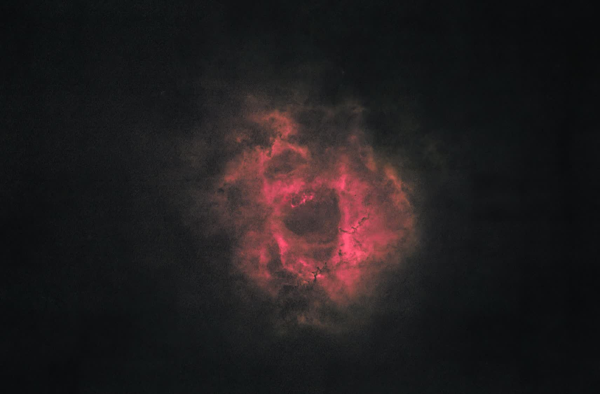
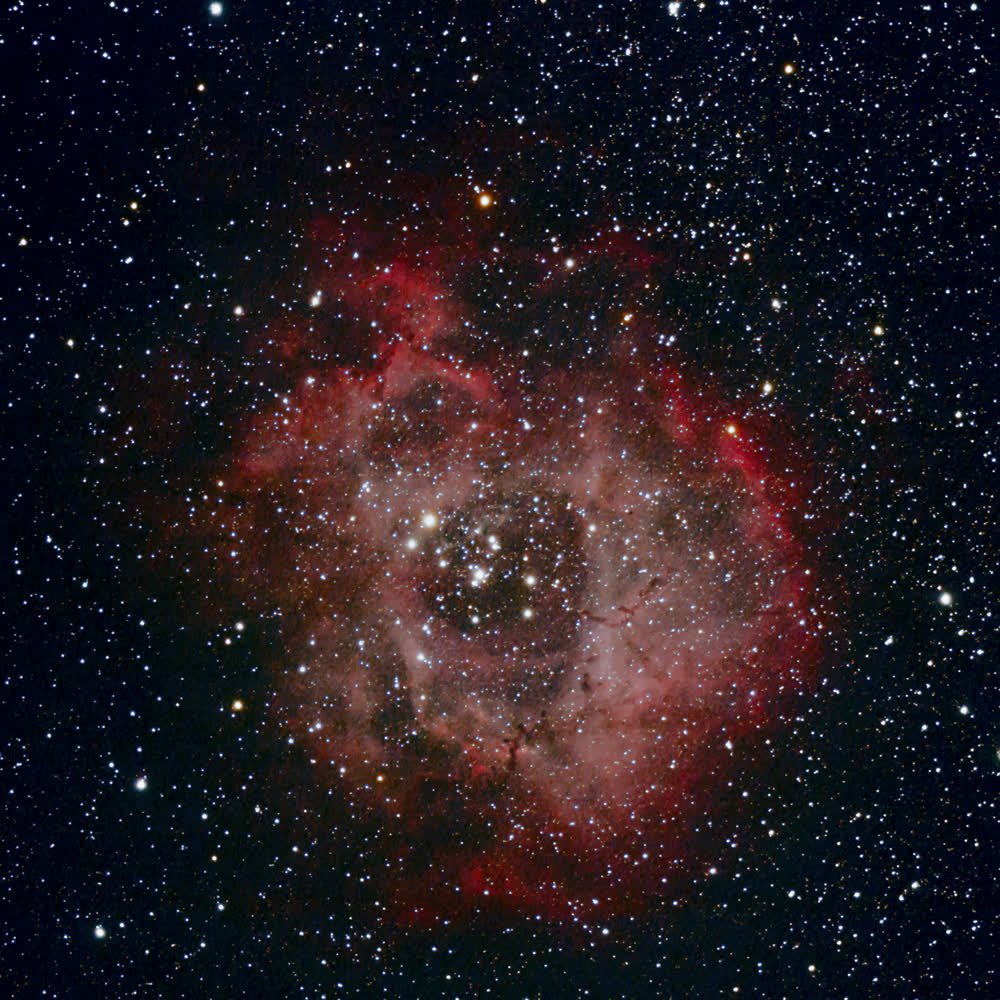

# Rosette Nebula 2014 V3H Old-Red Starless Layer

This branch applies the v3g old-red/depth treatment to the StarXTerminator starless layer without recombining the stars. It was created because the same red/depth treatment made the recombined v3g star field too warm.

Historical finished-work reference:

## Deliverables

| Product | Path |
| --- | --- |
| PixInsight working image | `work/03-nonlinear/03s-rosette-starxterminator-v3h-old-red-starless.xisf` |
| TIFF export | `work/03-nonlinear/rosette-starxterminator-v3h-old-red-starless.tif` |
| JPEG export | `work/03-nonlinear/rosette-starxterminator-v3h-old-red-starless.jpg` |
| Documentation preview | `docs/images/rosette-starxterminator-v3h-old-red-starless.jpg` |

## Processing Change

V3H uses the same parameters as the v3g old-reference branch, but sets `starScale=0`. This preserves the red/depth nebula treatment while avoiding the red/yellow cast that appeared when the stars were recombined.

Key parameters:

| Parameter | Value |
| --- | ---: |
| `starScale` | 0 |
| `nebulaContrast` | 0.25 |
| `redLift` | 0.175 |
| `greenDrop` | 0.10 |
| `satAmount` | 0.18 |
| `bgNeutral` | 0.62 |
| `skyDarken` | 0.65 |
| `depthContrast` | 0.35 |
| `warmDepth` | 0.085 |
| `blueDrop` | 0.85 |
| `blueTarget` | 0.38 |

## Use

Treat v3h as a nebula layer or starless presentation study, not as a complete final image. The cleaner with-stars presentation remains v3b unless a separate neutral star layer is recombined later.
