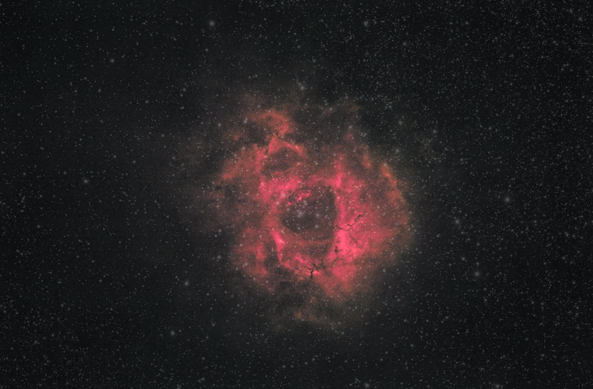

# Rosette Nebula 2014 V3I/V3J Subtle Stars

These branches add a restrained, mostly neutral star layer back onto the v3h old-red starless treatment. They were created after the v3g with-stars branch made too many stars look reddish.

Recommended version: **v3j sparse anchor stars**.


Softer alternate:



## Deliverables

| Branch | Product | Path |
| --- | --- | --- |
| v3i | PixInsight working image | `work/03-nonlinear/03s-rosette-starxterminator-v3i-subtle-sparse-stars.xisf` |
| v3i | JPEG export | `work/03-nonlinear/rosette-starxterminator-v3i-subtle-sparse-stars.jpg` |
| v3i | Documentation preview | `docs/images/rosette-starxterminator-v3i-subtle-sparse-stars.jpg` |
| v3j | PixInsight working image | `work/03-nonlinear/03s-rosette-starxterminator-v3j-sparse-anchor-stars.xisf` |
| v3j | JPEG export | `work/03-nonlinear/rosette-starxterminator-v3j-sparse-anchor-stars.jpg` |
| v3j | Documentation preview | `docs/images/rosette-starxterminator-v3j-sparse-anchor-stars.jpg` |

TIFF exports for both branches are also in `work/03-nonlinear/`.

## Processing Change

The script now supports applying the old-red/depth treatment before star recombination:

```text
depthBeforeStars=true
```

That keeps the red/depth treatment on the nebula layer. The stars are then added back from the StarXTerminator stars-only layer using a neutral/desaturated, threshold-gated recombination.

Shared old-red/depth settings:

| Parameter | Value |
| --- | ---: |
| `nebulaContrast` | 0.25 |
| `redLift` | 0.175 |
| `greenDrop` | 0.10 |
| `satAmount` | 0.18 |
| `bgNeutral` | 0.62 |
| `skyDarken` | 0.65 |
| `depthContrast` | 0.35 |
| `warmDepth` | 0.085 |
| `blueDrop` | 0.85 |
| `blueTarget` | 0.38 |
| `depthBeforeStars` | true |

Star recombination settings:

| Branch | `starScale` | `starDesat` | `starThreshold` | `starSoftness` | Read |
| --- | ---: | ---: | ---: | ---: | --- |
| v3i | 0.22 | 0.78 | 0.035 | 0.045 | Subtle stars, still fairly populated |
| v3j | 0.26 | 0.88 | 0.085 | 0.045 | Fewer anchor stars; best answer to the "subtle/small number of stars" goal |

## Caveat

These are visual presentation branches. The star colors are intentionally restrained and desaturated so the red/depth nebula treatment does not turn the whole field red.
